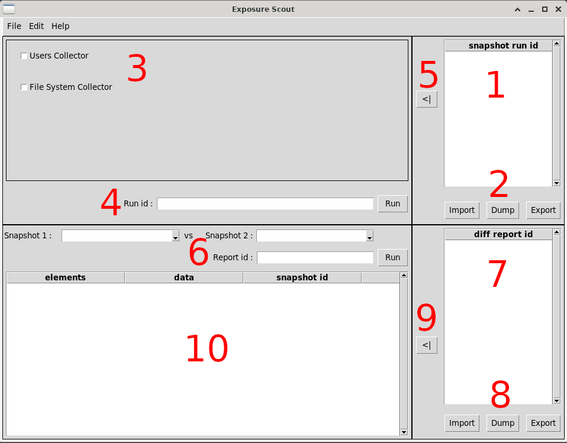

[](https://github.com/Tirette-hub/ExposureScout/actions/workflows/unittest_exposurescout.yml)

# **_Exposure Scout_**
_Exposure Scout_ is a tool designed to analyze and enhance the security posture of Linux/Unix systems, serving as a counterpart to the [Microsoft Attack Surface Analyzer](https://github.com/microsoft/AttackSurfaceAnalyzer).

In addition to the already existing features availabled on _MSASA_, _Exposure Scout_ is a standalone application and therefore does not require any other third-party tool nor python3 package. It also features multithreading for efficient data collection as well as filtering options (_WIP_) to simplify reports analysis.

In short, _Exposure Scout_ aims to help users identify and mitigate potential vulnerabilities, ultimately strengthening system defenses, especially when analysing the behavior of a specific application during its entire lifetime (installation, running, uninstallation).

This project was conducted in the context of a TraineeShip for my Master degree for a Vulnerability Assessment team which needed a standalone tool able to run from USB stick that would be fast and efficient on Linux/Unix platforms and easy to extend or maintain.

## Requirements
One of the major advantages of this tool relies on its need of no other requirements than the latest _Python3_ release version (Which is often natively available on Linux/Unix platforms). So you can install and use it directly.

## How to run the application
This application having been imagined as modular as possible provides multiple ways to be used. Either as a standalone CLI or GUI application or even as a module itself, allowing the user to develop a simple script for plug-and-play usage.

### CLI
The `main.py` file contains the application that is based on the package itself. You can easily run it using `python3 main.py` and simply follow the instructions on the screen. You can run personnalised snapshots, make a _diff_ between two snapshots, visualize the reports in a python _dict_ data structure, export and import both snapshots and reports (currently only BINARY solution available) and manage your application memory thanks to the [Analysis Manager](./docs/AM.md).

### GUI
You can either launch the GUI application itself via `python3 gui.py` or from within the the CLI application calling the gui command in its menu. When launching it from the CLI application, it creates a new process but shares its [Analysis Manager](./docs/AM.md). It means that you can perform some manipulations through the CLI application then launch the GUI one and still work on the same manipulated data.

<p align="center"></p>

1. The snapshot memory manager is where are listed the snapshots currently available in the application memory (managed by the [Analysis Manager](./docs/AM.md)).
2. You can Import, Dump or Export those snapshots.
3. You can choose the collectors you want to be used in order to run a snapshot.
4. You can choose a name for your snapshot. If you don't, it will use the date and time at the moment you press the _Run_ button. After running the snapsot, the snapshot memory manager is updated as well as the dropdown entries where you pick the snapshots in the report maker.
5. [_WIP_] You can send quickly a snapshot to the report maker.
6. The report maker allows you to choose the different snapshots you want to compare. You can only pick snapshots that are currently available in the snapshot memory manager. **The order in which the _snapshot1_ and _snapshot2_ are set DOES matter.** If you do not set the report id, it will set it automatically to _"[snapshot1] vs [snapshot2]"_. After running the report, the report memory manager is updated as well.
7. The report memory manager is the same as 1 but for reports.
8. Same as 2 but for the reports in the report memory manager.
9. This button send the report to the report inspector.
10. The report inspector allows you to inspect a reports. It shows a tree structure where you can show only the collector or collectible data you want.

### As a module (API)
You can easily call the package to use its different features so you can develop scripts for very specific usage.

Please refer to the [examples](./examples) README in order to get a better description and some practival examples on how to use the application as a module.

## Current list of collectors
- LinUsersCollector : used to collect Linux/Unix users, groups and sudoers
- LinFileSystemCollector : used to collect Linux/Unix File System

## Application Architecture
_Exposure Scout_ relies on two simple modules: _modules_ and _core_. It also provides useful directories to store reports, documentation, scripts and provide some practical examples and test files.

### [core](./exposurescout/core/) 
It contains all the core features the application uses. Any modification of an existing feature in this core module could lead to an entirely broken application if not carefuly or correctly handled.

For any further explanation on its implementation please refer to the [core documentation](./docs/CORE.md).

### [modules](./exposurescout/modules/) 
If you want to define a new data collector for your snapshots, or a new simple feature to use in the application, you can add it there. It mainly contains the different collectors used by the application.

For any further explanation on how it works and how to develop a new module please refer to the [modules documentation](./docs/MODULES.md).

### [scripts](./exposurescout/scripts/) 
This is were you can store your bash scripts used by collectors if you need so. [UsersCollector.py](./exposurescout/modules/UsersCollector.py) uses such a mechanism to collect users, groups and sudoers.

__*Pay some attention to execution rights when executing such scripts.*__

### [reports](./reports/)
It is where the snapshots and the diff reports are stored.

### [examples](./examples/)
It contains a few scripts you can use to see how the different modules can be used and called. It can be very usefull if you want to use this tool as a module. You can run an example by using this command, from this project root directory:
``` bash
$ cp examples/%example_filename% ./
$ python3 %example_filename%
```

**Note that the example file must be in this project root directory and not in the _examples_ directory prior to be executed.**

### [doc](./docs/)
There you can find the detailed documentation of the different python files. Every method is described in the code, even "private" ones to ease the development.

### [tests](./exposurescout/tests/)
All test related files are available in this directory. To run them, use the [_run\_tests.sh_](./run_tests.sh) script or use the following command in the main directory of the application:
``` bash
$ python3 -m unittest discover -s tests -t . -v
```
